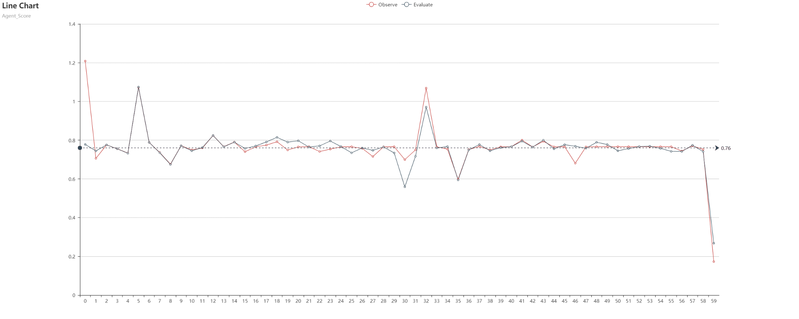

# Real-Estate-Agent-Scoring-System
This project aims to design Agent Scoring System which combines Machine Learning & Full Stack Design
* Using PCA to calculate weights of each agent's features and do sum of these features to get agent history score
* Ensambling RNN & Time Series models to do prediction about agent future 5 quarter's score
* Designing App of agent_score to show result data visualization on website

## Requirment
* Installing evritual enviroment on your PC to avoid Python libirary version confliction:
  * **$ pip install virtualenv**
* Setting up vitual enviroment:
  * **$ virtualenv venv**
* Pointing to which version of python you want to use under virtual enviroment:
  * **$ virtualenv -p c:\python3\python.exe venv**
* Activating virtual enviroment:
  * **$ activate venv**
* Deactivating virtual enviroment:
  * **$ deactivate venv**

## Enviroment:
* Python 3.x (skicit-learn, Tensorflow, Django, pyecharts)
* SQL
* Pycharm / JupyterNotebook / Spider

## Project Process:
* Setting Enviroment:
  * **$ cd :/mysite**
  * **$ activate venv**
* Prediction Model:
  * Confirm current location:
    * **$ cd :/mysite/model**
  * Data Input
    * Checking whether data existing in current file **data.csv_**
    * **$ python Data_Input.py** to import data to memory
  * Data Cleaning & Wrangling
    * **$ python Data_Processing.py** to achieve six functions to clean our raw data
  * Data Merging & Motification
    * **$ python Data_Merging.py** & **$ Data_Merging.py** to prepare data we will input to our model
  * PCA (Designing Agent Scoring Criterion)
    * **$ python PCA.py** to create a class which can achieve agent_scoring_criterion
  * LSTM Modeling design
    * **$ python LSTM.py** to create a class which can achieve RNN based on Tensorflow
  * Hybrid LSTM & TimeSeries
    * **$ python Model_Hybrid.py** to combine RNN with TimeSeries and get prediction result saved in **_.json_** form   
* Application to Connect with Model Output:
  * Import model output to database:
    * **$ python database.py**
  * Running application:
    * **$ python manage.py runserver**
    
## Result
* The result will be showed on your local computer chrome webpage-**http://127.0.0.1:8000/**
  * The first page is showing all list of agent_id
* Clicking the agent_id you will see the jump page
  * **Observe**(raw_score data) & **Evaluate**(model_score data)
  * The **Average_Score** of **Observe** & **Evaluate** to check our model's accuracy
  * Point represents each quarter's score
* One example of Agent_id == 2059
   
   
## Update
* 2018/09/01 Started working on this project
* 2018/09/30 Finished the demo of models (Tensorflow)
* 2018/10/20 Finished the sample demo of the Django framework
* Present still working the front end design to add the prediction values into one chart
